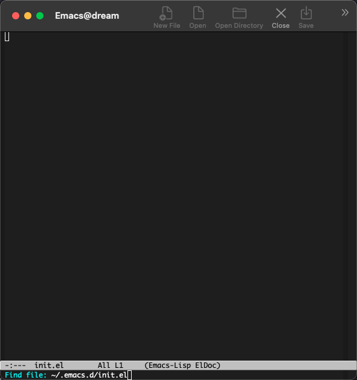
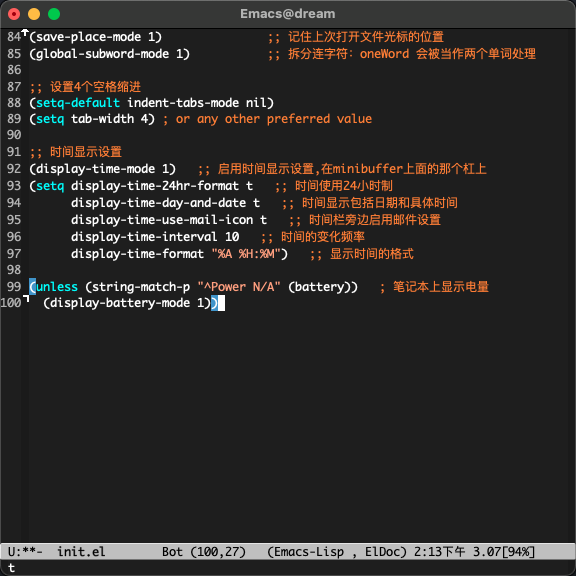
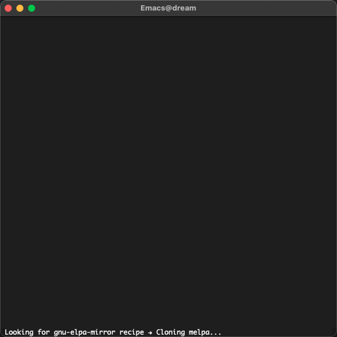
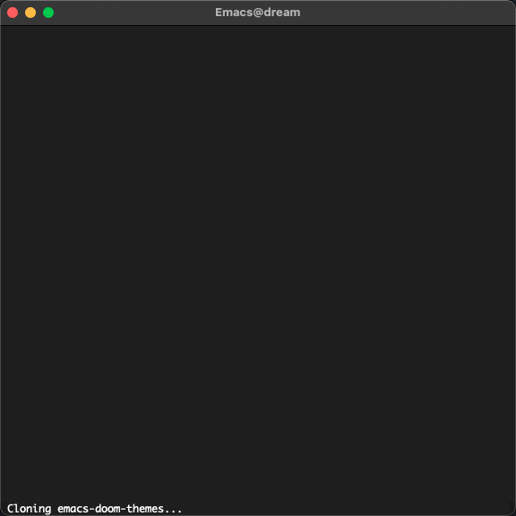
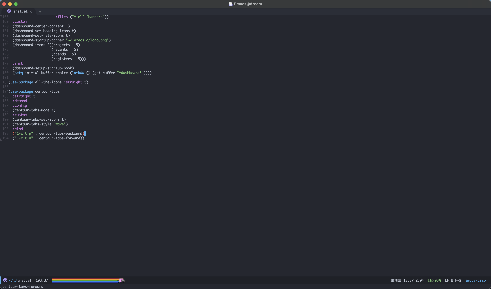

# Table of Contents

1.  [前言](#org265fca0)
2.  [安装、启动、退出](#orgd97d57b)
    1.  [Linux](#org1492153)
    2.  [macOS](#org36804a1)
    3.  [Windows](#org9b5c0ee)
    4.  [退出 Emacs](#orgce7e752)
3.  [黑话](#org86e1839)
    1.  [快捷键](#org60be923)
    2.  [概念](#org13c537d)
    3.  [buffer](#org69e4161)
4.  [基本增强](#org270db4e)
    1.  [创建配置文件](#orga1be26b)
    2.  [基本配置](#orga32dce8)
    3.  [插件包管理](#org4b8fcc0)
    4.  [外观](#orga6f30fd)
    5.  [操作](#orga73f436)
5.  [操作习惯的改变](#org9c11478)
    1.  [是否需要左侧目录树？](#org977d67e)
    2.  [是否需要 Tabbar？](#orgdea34a0)
    3.  [习惯 `M-x` 和 `C-h ?`](#orgd9c0411)
    4.  [高效移动](#org6ddb1c1)
    5.  [复制粘贴](#orgdda1bc0)
6.  [准备笔记记录](#org05fd57b)
7.  [开始笔记记录](#org8dc2c29)
8.  [收集笔记：org-protocol](#orgfad6867)
9.  [托管笔记：magit](#org2fd9dbb)
10. [导出 Hugo 站点](#orgf7841fa)
11. [发布 GitHub Pages](#org05eed15)
    1.  [GitHub workflow](#orgcad44ef)
12. [接下来？](#org33e355a)

其他入门教程：

-   [一年成为Emacs高手 (像神一样使用编辑器)](https://github.com/redguardtoo/mastering-emacs-in-one-year-guide)。
-   [An Emacs Tutorial for Vim User](https://github.com/w0mTea/An.Emacs.Tutorial.for.Vim.User)

# 前言

不同于其他 Emacs 教程，本文着重于从零开始通过 Emacs 做笔记管理，这样做的好处如下：

-   不着眼于替换你现在的编辑器或者 IDE 避免降低工作效率；
-   org-mode 是一种非常具有表达力的文档标记格式，并且配合 org-babel 可以执行代码块保存实验结果（类似 Jupyter Notebook）；
-   [org-roam](https://github.com/org-roam/org-roam) 基于 org-mode 实现来 Roam Research<a id="fnr.1" class="footref" href="#fn.1">1</a>, <a id="fnr.2" class="footref" href="#fn.2">2</a> 的方式进行先进的笔记管理；
-   基于 GitHub 可以实现免费的托管和；
-   配合 [ox-hugo](https://github.com/kaushalmodi/ox-hugo/) 生成 [hugo](https://gohugo.io) 站点并结合 GitHub Pages 免费发布到网上。

也许通过这个你可以爱上 Emacs 并开始将它作为主要编辑器最终助力你提升工作效率。

# 安装、启动、退出

现在最新稳定版是 27.2，主线版本是 Emacs 28 并且已经合并 Native Comp，我日常使用的就是编译了 Native Comp 的主线版本。
为了贴合我们的主题我们这里选择最新的稳定版本 27.2 进行，建议大家也安装最新稳定版 27.2。

## Linux

-   yum（CentOS/RHEL/Fedora）
-   apt（Debian/Ubuntu）
-   pacman（Archlinux）

## macOS

macOS 默认安装了 Emacs，但是版本比较低，建议大家从社区安装最新版。我之前比较常用的是 emacs-mac 这个版本，可以通过 [Homebrew](https://brew.sh/) 安装：

    $ brew tap railwaycat/emacsmacport
    $ brew install emacs-mac

然后在终端里通过以下命令打开 Emacs：

    $ open -a /usr/local/opt/emacs-mac/Emacs.app/

## Windows

可以通过 Powershell 和 [Chocolatey](https://chocolatey.org/)<a id="fnr.3" class="footref" href="#fn.3">3</a> 安装：

    PS> choco install emacs-full

安装后可以在 Powershell 中启动 Emacs：

    PS> emacs

## 退出 Emacs

快捷键按 `C-x C-c` （就是按住 `Ctrl` 不松开继续按 `x` ，然后再按住 `Ctrl` 不松开继续按 `c` ，聪明的你肯定发现只要按住 `Ctrl` 不松开依次按 `x` 和 `c` 键就可以了）。

# 黑话

Emacs 诞生的时间比较早，有些概念也是很早就确定了，带着时代的气息，可能不是很好理解。所以为了便于大家理解，我们在此提前进行解释，大家遇到不懂的可以随时翻回来查看:

## 快捷键

<table border="2" cellspacing="0" cellpadding="6" rules="groups" frame="hsides">

<colgroup>
<col  class="org-left" />

<col  class="org-left" />
</colgroup>
<thead>
<tr>
<th scope="col" class="org-left">黑话</th>
<th scope="col" class="org-left">解释</th>
</tr>
</thead>

<tbody>
<tr>
<td class="org-left"><code>C-c</code></td>
<td class="org-left">按住 <code>Ctrl</code> 不松开然后按 <code>c</code></td>
</tr>

<tr>
<td class="org-left"><code>C-x b</code></td>
<td class="org-left">按住 <code>Ctrl</code> 不松开按 <code>x</code>, 然后松开以上按键后再按 <code>b</code></td>
</tr>

<tr>
<td class="org-left"><code>C-x C-c</code><a id="fnr.4" class="footref" href="#fn.4">4</a></td>
<td class="org-left">组合快捷键，你需要先按出 <code>C-x</code> ，然后继续按出 <code>Ctrl-c</code> ，两段快捷键中间可以间隔任意时间</td>
</tr>

<tr>
<td class="org-left"><code>C-g</code></td>
<td class="org-left">假如你快捷键按到一半想要放弃，可以通过这个快捷键放弃。（当然不仅是放弃快捷键，很多操作都可以通过这个快捷键终止）</td>
</tr>

<tr>
<td class="org-left"><code>M-x</code></td>
<td class="org-left"><code>Meta</code> + <code>c</code> ，Meta 键一般意味着 Alt 或者 ESC</td>
</tr>

<tr>
<td class="org-left"><code>s-l</code></td>
<td class="org-left"><code>Super</code> + <code>l</code> , Super 键现在比较少见，可以通过 <code>C-x @-s</code> 按出 <code>s-</code> 前缀，所以这个完整的快捷键是 <code>C-x @-s l</code></td>
</tr>

<tr>
<td class="org-left"><code>M-x org-id-get-create RET</code></td>
<td class="org-left"><code>M-x</code> 会弹出命令输出框，然后输入 <code>org-id-get-create</code> 按回车（ <code>RET</code> 表示回车）</td>
</tr>
</tbody>
</table>

## 概念

<table border="2" cellspacing="0" cellpadding="6" rules="groups" frame="hsides">

<colgroup>
<col  class="org-left" />

<col  class="org-left" />
</colgroup>
<thead>
<tr>
<th scope="col" class="org-left">黑话</th>
<th scope="col" class="org-left">解释</th>
</tr>
</thead>

<tbody>
<tr>
<td class="org-left">frame</td>
<td class="org-left">图形界面的窗口：通过 <code>C-x 5 2</code> 创建一个试试，然后 <code>C-x 5 0</code> 关闭</td>
</tr>

<tr>
<td class="org-left">window</td>
<td class="org-left">分割面板：通过 <code>C-x 2</code> 水平分割， <code>C-x 3</code> 垂直分割， <code>C-x o</code> 切换面板， <code>C-x 0</code> 关闭当前面板</td>
</tr>

<tr>
<td class="org-left">face</td>
<td class="org-left">文本显示方式，字体等</td>
</tr>

<tr>
<td class="org-left">fringe</td>
<td class="org-left">分割面板的边缘</td>
</tr>

<tr>
<td class="org-left">kill</td>
<td class="org-left">剪切， <code>C-k</code> 剪切光标后面到行尾</td>
</tr>

<tr>
<td class="org-left">kill-ring</td>
<td class="org-left">剪切板，可以保存多个，可以通过 <code>M-y</code> 选择</td>
</tr>
</tbody>
</table>

## buffer

这个可能和大多数编辑器不太一样，Emacs 突出了 buffer 的语义，从而弱化了编辑文件语义，比如在其他编辑器或者 IDE 你可能是想的切换编辑文件，
但是 Emacs 更突出了是切换到对应的 buffer（ `C-x b` ） 编辑，而后通过 `C-x C-s` 将 buffer 的内容保存到文件中（如果是生成的 buffer 则会提示选择要保存的文件名）。

同时 Emacs 有很多临时的 buffer 来充当日志的角色，比如默认的 `*Messages*` (`C-x b *Messages* RET`) 就是一个只读 buffer 显示一些日志信息，某些操作失败了之后也会保存一些错误消息到指定的 buffer 中，我们只要切换过去就能看到。

# 基本增强

默认安装的 Emacs 可以说是又丑又不好用，所以为了使用更加顺畅或者更贴合现代编辑器，我们需要修改一些配置并做一些插件的扩展。

## 创建配置文件

Emacs 的配置文件都写在 `$HOME/.emacs.d/init.el` 中，其中 `$HOME` 就是用户的家目录，对应到不同的系统位置会有细微的差异：

-   Linux 或者 macOS:

        mkdir ~/.emacs.d/
        touch ~/.emacs.d/init.el
-   Windows: C:/Users/<username>/AppData/Roaming/.emacs.d/init.el（这个目录很深，而且默认状态下AppData目录是隐藏的。）<a id="fnr.5" class="footref" href="#fn.5">5</a>

## 基本配置

此时我们打开 Emacs 进行如下操作： `C-x C-f ~/.emacs.d/init.el RET` 并进行一些基本的配置：

    ;; 指定自定义配置文件，防止自定义配置污染 init.el，并加载该配置文件
    (setq custom-file (expand-file-name "~/.emacs.d/custom.el"))
    (if (file-exists-p custom-file)
        (load custom-file))

    ;;; init-commont.el -- Emacs 基本配置
    ;;;
    ;;; Commentary:
    ;;;
    ;;;    基本配置
    ;;; Code:
    ;;;

    ;; 中文显示
    (set-language-environment "utf-8")
    (set-buffer-file-coding-system 'utf-8)
    (set-terminal-coding-system 'utf-8)
    (set-keyboard-coding-system 'utf-8)
    (set-selection-coding-system 'utf-8)
    (set-default-coding-systems 'utf-8)
    (set-clipboard-coding-system 'utf-8)
    (modify-coding-system-alist 'process "*" 'utf-8)
    (prefer-coding-system 'utf-8)
    (setq-default pathname-coding-system 'utf-8)
    (setq
     default-process-coding-system '(utf-8 . utf-8)
     locale-coding-system 'utf-8
     file-name-coding-system 'utf-8
     default-buffer-file-coding-system 'utf-8
     slime-net-coding-system 'utf-8-unix)

    (setenv "LC_CTYPE" "UTF-8")
    (setenv "LC_ALL" "en_US.UTF-8")
    (setenv "LANG" "en_US.UTF-8")                           ; Iterate through CamelCase words

    ;; 基本设置
    (setq-default
     indicate-buffer-boundaries 'left ;; 在窗口边缘上显示一个小箭头指示当前 buffer 的边界
     delete-by-moving-to-trash t                      ;; 删除文件移动到垃圾箱
     window-combination-resize t                      ;; 新窗口平均其他左右窗口
     x-stretch-cursor t                               ;; 将光标拉伸到字形宽度
     kill-whole-line t)  ;; C-k时,同时删除该行

    (setq
     fringes-outside-margins t   ;; fringe 放在外面
     echo-keystrokes 0.1         ;; 尽快显示按键序列
     system-time-locale "zh_CN"  ;; 设置系统时间显示格式
     tab-always-indent 'complete ;; Tab 键优先格式化再补全
     font-lock-global-modes '(not shell-mode text-mode) ;; 设置语法高亮.除shell-mode和text-mode之外的模式
     mouse-yank-at-point t       ;; 不在鼠标点击的地方插入剪贴板内容
     kill-ring-max 200           ;; 设置 kill ring 个数
     default-fill-column 60      ;; 把fill-column设为60.让文字更好读
     enable-recursive-minibuffers t  ;; 递归的使用minibuffer
     scroll-margin 3             ;; 在靠近屏幕边沿 3 行时就开始滚动,可很好看到上下文
     scroll-conservatively 10000 ;; 防止页面滚动时跳动
     select-enable-clipboard t   ;; 允许emacs和外部程序进行粘贴
     track-eol t                 ;; 当光标在行尾上下移动的时候,始终保持在行尾
     next-line-add-newlines nil  ;; 按C-n或down时不添加新行
     ;; emacs启动时显示的内容可以通过变量initial-scratch-message来设置
     initial-scratch-message nil
     dired-listing-switches "-vha" ;;  dired 列出文件的参数（man ls）
     show-paren-style 'parenthesis ;; 括号匹配时高亮显示另一边的括号，而不是跳到另一个括号处
     undo-limit 80000000           ;; 提升撤销限制
     auto-save-default t           ;; 打开自动保存
     truncate-string-ellipsis "…"  ;; Unicode ellispis are nicer than "...", and also save /precious/ space
     ;; 当寻找一个同名的文件,改变两个buffer的名字,前面加上目录名
     uniquify-buffer-name-style 'post-forward-angle-brackets)
    (menu-bar-mode -1)            ;; 取消菜单栏
    (scroll-bar-mode -1)          ;; 取消滚动条（在 Emacs 26 中无效）
    (tool-bar-mode -1)            ;; 取消工具栏
    (fset 'yes-or-no-p 'y-or-n-p) ;; 按y或space表示yes,n表示no
    (global-font-lock-mode t)     ;; 语法高亮
    (show-paren-mode t)           ;; 打开括号匹配显示模式
    (mouse-avoidance-mode 'animate) ;; 鼠标靠近光标指针时,让鼠标自动让开
    (auto-compression-mode 1) ;; 打开压缩文件时自动解压缩
    (global-auto-revert-mode 1)       ;; 自动重载更改的文件
    (blink-cursor-mode -1)            ;; 指针不要闪
    (toggle-truncate-lines t)         ;; 当一行文字太长时,不自动换行
    (column-number-mode t)            ;; 在minibuffer上面的状态栏显示文件的行号,列号
    (line-number-mode t)              ;;设定显示文件的参数,以版本/人性化的显示,就是ls的参数
    (global-linum-mode t)             ;; 显示行号
    (require 'saveplace)
    (save-place-mode 1)               ;; 记住上次打开文件光标的位置
    (global-subword-mode 1)           ;; 拆分连字符：oneWord 会被当作两个单词处理

    ;; 设置4个空格缩进
    (setq-default indent-tabs-mode nil)
    (setq tab-width 4) ; or any other preferred value

    ;; 时间显示设置
    (display-time-mode 1)   ;; 启用时间显示设置,在minibuffer上面的那个杠上
    (setq display-time-24hr-format t   ;; 时间使用24小时制
          display-time-day-and-date t   ;; 时间显示包括日期和具体时间
          display-time-use-mail-icon t   ;; 时间栏旁边启用邮件设置
          display-time-interval 10   ;; 时间的变化频率
          display-time-format "%A %H:%M")   ;; 显示时间的格式

    (unless (string-match-p "^Power N/A" (battery))   ; 笔记本上显示电量
      (display-battery-mode 1))

此时我们可以运行当前 buffer 让配置生效： `M-x eval-buffer RET` ，然后通过 `C-x C-s` 进行保存。
此时效果如下：

对比上面可以看到中间灰色的（modeline）增加显示了时间、电量，并且去掉了菜单栏滚动条等，并且在左边显示了行号。同时我觉得有必要解释下 modeline（底部灰色的横幅）各个部分的值：

-   `U:**-` 可以简单的理解为 U 表示编码系统（UTF-8）， `**` 表示 buffer 更改（未保存）<a id="fnr.6" class="footref" href="#fn.6">6</a>
-   `Bot(100,27)` 表示光标位置 Bot 即 Bottom 的缩写，即 Bottom(row,column) 。
-   `(Emacs-Lisp, ElDoc)` 表示当前 buffer 的主模式和次模式（主模式只能有一个，但是次模式可以有多个）。

## 插件包管理

Emacs 安装插件的方式多种多样，一般可以：

-   简单粗暴：直接拷贝 elisp 文件到指定位置；
-   内置的 package.el 可以安装 [MELPA](https://melpa.org/#/getting-started) 的包。
-   [el-get](https://github.com/dimitri/el-get) 可以支持多种源，如 MELPA、EmacsWiki、GitHub 等等
-   [straight.el](https://github.com/raxod502/straight.el) 同样支持很多种源，并集成了 el-get 的源，同时还支持版本锁定、集成 `use-package` 、指向 fork、本地修改等。

目前我正在使用的就是 `use-package` + `straight.el` 的方式， `use-package` 感觉不是很适合小白，因为很多搜索到的配置在 `use-package` 下要做一些改变，所以在这里我也是很纠结要不要用 `use-package` 。
但是我相信通过简单的学习，这些应该不会成为障碍，所以这里我们就以 `use-package` + `straight.el` 作为我们的插件包管理方案。

为了启动整个包管理世界，我们需要先安装包管理，手动的安装：

    $ cd ~/.emacs.d/
    $ git clone git@github.com:jwiegley/use-package.git
    $ git clone git@github.com:raxod502/straight.el.git straight/repos/straight.el

然后在 `init.el` 中追加如下内容：

    ;; use package
    (eval-when-compile
      (add-to-list 'load-path "~/.emacs.d/use-package")
      (require 'use-package))

    ;; straight.el to manage package
    (defvar bootstrap-version)
    (let ((bootstrap-file
           (expand-file-name "straight/repos/straight.el/bootstrap.el" user-emacs-directory))
          (bootstrap-version 5))
      (unless (file-exists-p bootstrap-file)
        (with-current-buffer
            (url-retrieve-synchronously
             "https://raw.githubusercontent.com/raxod502/straight.el/develop/install.el"
             'silent 'inhibit-cookies)
          (goto-char (point-max))
          (eval-print-last-sexp)))
      (load bootstrap-file nil 'nomessage))

然后我们开始执行当前 buffer： `M-x eval-buffer RET` ，然后 straight.el 就会开始同步源：

## 外观

经过漫长的等待之后，我们终于可以进行下一步了：美化！我们将安装配置以下插件：

-   doom-theme
-   doom-modeline
-   nyan-mode
-   all-the-icons
-   emojify
-   dashboard
-   centaur-tabs

将以下配置追加到 `init.el` 中：

    ;;; Appearance
    (use-package doom-themes
      :ensure t
      :straight (doom-themes :host github :repo "hlissner/emacs-doom-themes"
                             :files ("*.el" "themes"))
      :init
      ;; Global settings (defaults)
      (setq doom-themes-enable-bold t    ; if nil, bold is universally disabled
            doom-themes-enable-italic t) ; if nil, italics is universally disabled
      ;; Load the theme (doom-one, doom-molokai, etc); keep in mind that each theme
      ;; may have their own settings.
      ;; (load-theme 'doom-nord t)
      (load-theme 'doom-vibrant t)

      ;; Enable flashing mode-line on errors
      (doom-themes-visual-bell-config)

      ;; Enable custom neotree theme
      (doom-themes-neotree-config)  ; all-the-icons fonts must be installed!

      ;; Corrects (and improves) org-mode's native fontification.
      (doom-themes-org-config))

    (use-package doom-modeline
      :straight t
      :after nyan-mode
      :custom
      (doom-modeline-mu4e nil)
      (doom-modeline-gnus nil)
      (doom-modeline-buffer-file-name-style 'truncate-all)
      :init
      (doom-modeline-mode 1))

    (use-package nyan-mode
      :straight t
      :init
      (nyan-mode 1))

    (use-package emojify
      :straight (emojify :host github :repo "iqbalansari/emacs-emojify"
                         :files ("*.el" "data"))
      :hook
      (after-init . global-emojify-mode)
      :init
      (setq emojify-emoji-styles '(unicode github)))

    (use-package dashboard
      :straight (dashboard :host github :repo "emacs-dashboard/emacs-dashboard"
                           :files ("*.el" "banners"))
      :custom
      (dashboard-center-content 1)
      (dashboard-set-heading-icons t)
      (dashboard-set-file-icons t)
      (dashboard-startup-banner "~/.emacs.d/logo.png")
      (dashboard-items '((projects . 5)
                         (recents . 5)
                         (agenda . 5)
                         (registers . 5)))
      :init
      (dashboard-setup-startup-hook)
      (setq initial-buffer-choice (lambda () (get-buffer "*dashboard*"))))

    (use-package all-the-icons :straight t)

    (use-package centaur-tabs
      :straight t
      :demand
      :config
      (centaur-tabs-mode t)
      :custom
      (centaur-tabs-set-icons t)
      (centaur-tabs-style "wave")
      :bind
      ("C-c t p" . centaur-tabs-backward)
      ("C-c t n" . centaur-tabs-forward))

又是一次漫长的等待！

好了，现在我们还需要安装一下 `all-the-icons` 的字体： `M-x all-the-icons-install-fonts RET` 。现在再看我们的 Emacs：

是不是漂亮多了（特意放大了窗体）！

## 操作

在上面的配置过程中你可能已经感觉了 `M-x` 、 buffer 切换、文件打开等不太好用，其实社区已经有成熟的补全框架，可以对类似的场景进行补全，
我们将通过一下插件增强操作性：

-   ivy + counsel + swiper
-   which-key 当时忘记下面该按哪个键的时候可以对你进行提醒

# 操作习惯的改变

## 是否需要左侧目录树？

## 是否需要 Tabbar？

## 习惯 `M-x` 和 `C-h ?`

## 高效移动

## 复制粘贴

# 准备笔记记录

-   org-mode
-   org-roam
-   org-superstar
-   org-journal

# 开始笔记记录

# 收集笔记：org-protocol

# 托管笔记：magit

# 导出 Hugo 站点

# 发布 GitHub Pages

## GitHub workflow

# 接下来？

遇到不会的就去问搜索引擎、社区、身边的人、提 Issue 等，掌握 Emacs 无他，但手熟尔!

# Footnotes

<a id="fn.1" href="#fnr.1">1</a> [https://www.nateliason.com/blog/roam](https://www.nateliason.com/blog/roam)

<a id="fn.2" href="#fnr.2">2</a> [How To Take Smart Notes: 10 Principles to Revolutionize Your Note-Taking and Writing](https://fortelabs.co/blog/how-to-take-smart-notes/)

<a id="fn.3" href="#fnr.3">3</a> [在 Windows 上安装 GNU Emacs](https://zhuanlan.zhihu.com/p/111673670)

<a id="fn.4" href="#fnr.4">4</a> 这是退出 Emacs 的快捷键，非常有用，相信我

<a id="fn.5" href="#fnr.5">5</a> <https://www.jianshu.com/p/186a3409e878>

<a id="fn.6" href="#fnr.6">6</a> 其实这里要复杂的多，具体的可以参见文档 [Mode Line](https://www.gnu.org/software/emacs/manual/html_node/emacs/Mode-Line.html)
